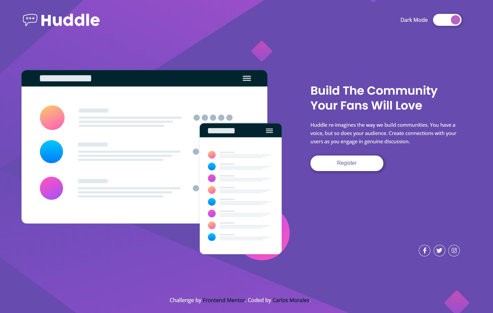
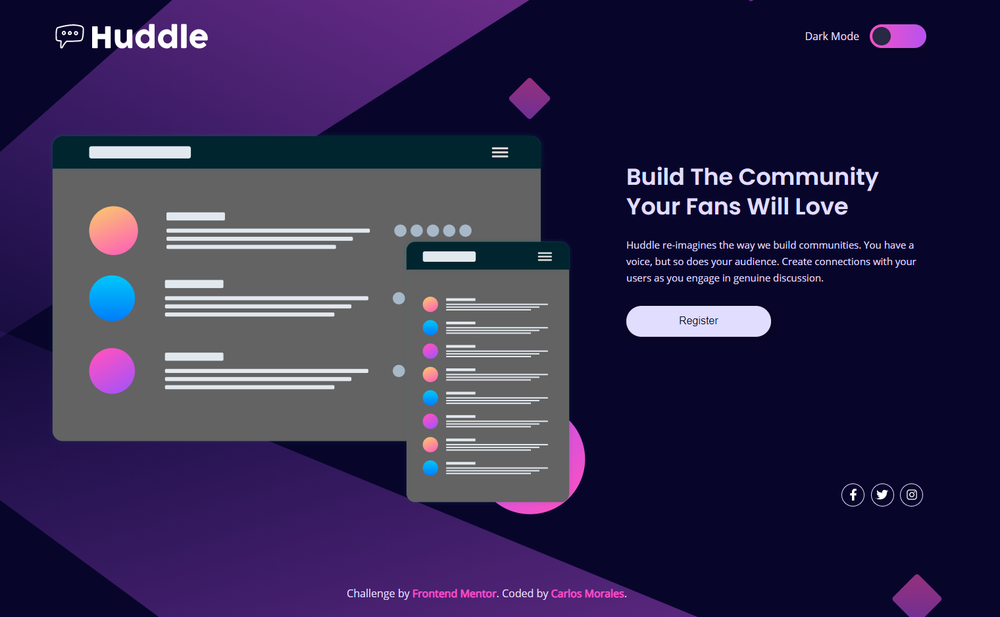
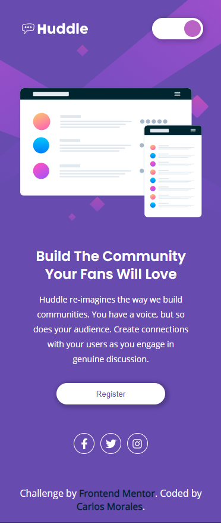
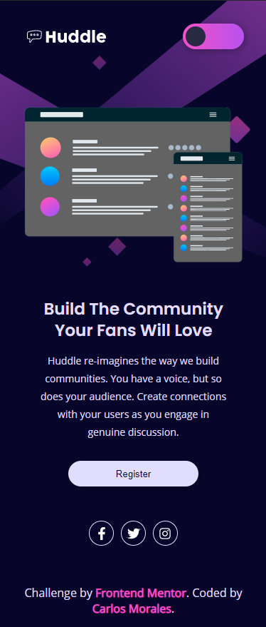

# Article Component

## ✍🏻 Descripción

Realize este challenge de [Frontend Mentor](https://www.frontendmentor.io/) para poner a prueba mis skills de HTML, CSS y JS.
También le añadi un switch para probar el dark mode, el cual se guarda en el Local Storage :3

## 🚀 Comenzando

Solo debes clonarlo abrir el index.html y listo 😊

## 🎨 Demo

Puedes ver el demo aquí → [Article Component](https://cjosue15.github.io/landing-page-huddle/)

🖥 Version Escritorio | Light Mode - Dark Mode

📱 Version Celular | Light Mode - Dark Mode

## 🛠️ Construido con

-   HTML
-   CSS
-   JS

---

⌨️ con ❤️ por [Carlos Morales](https://github.com/cjosue15) 😊
